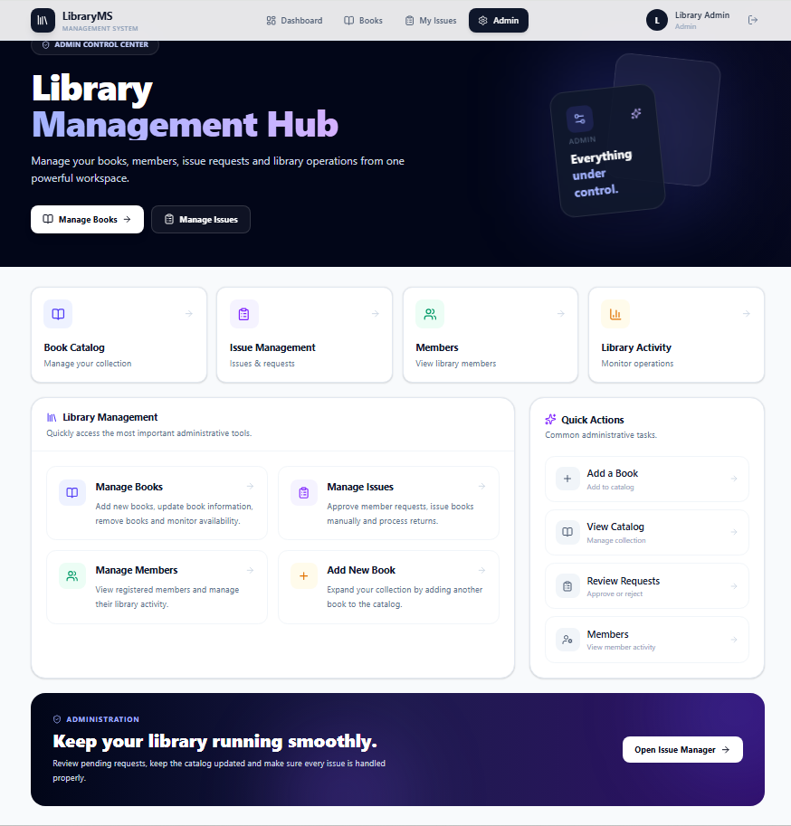
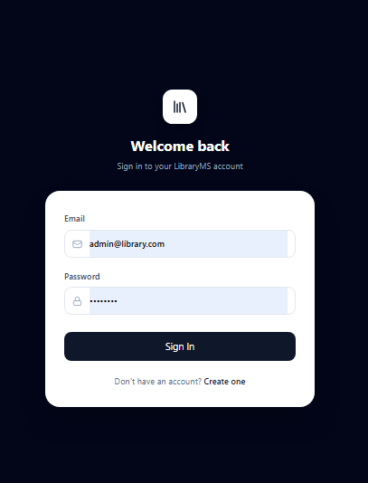
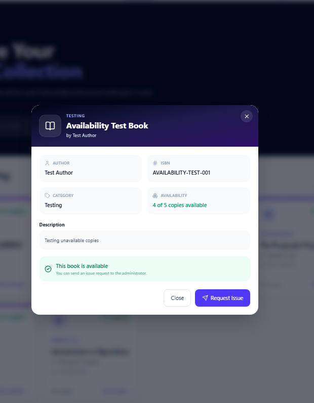
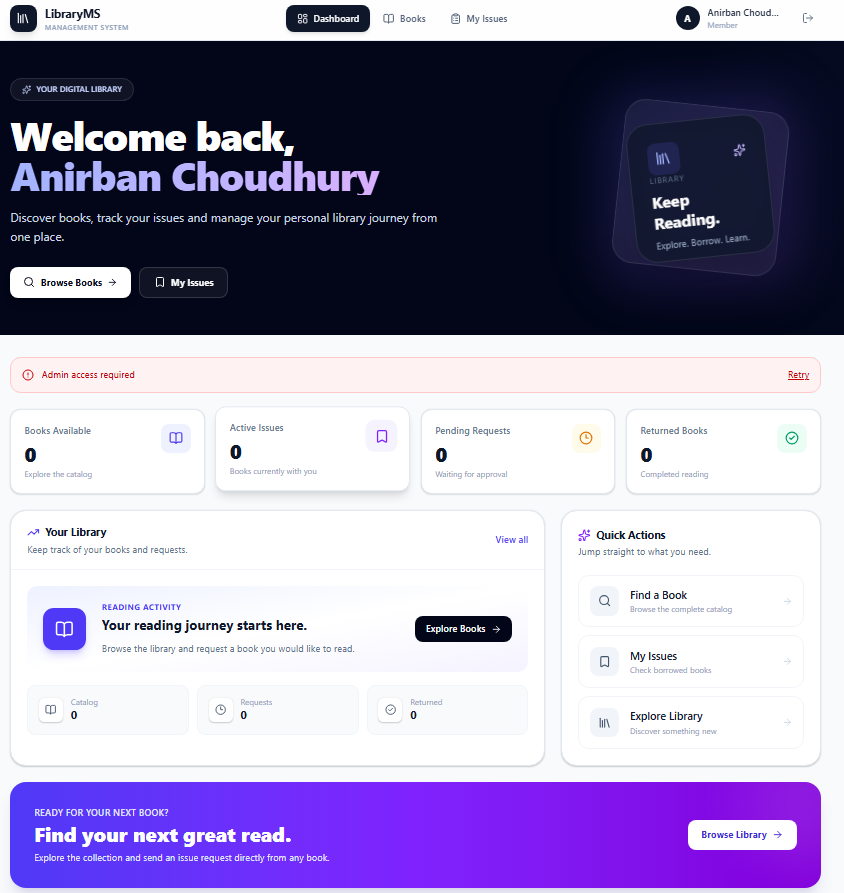
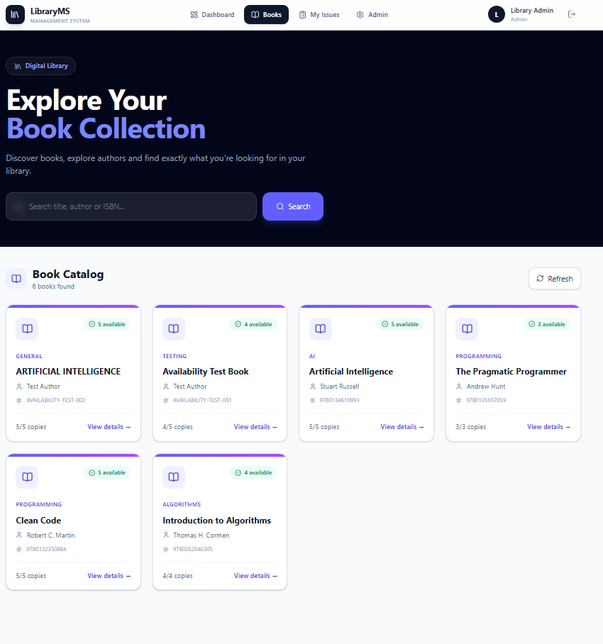
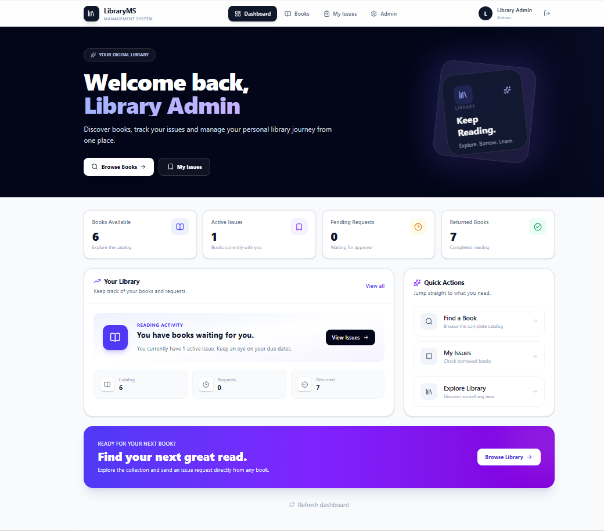
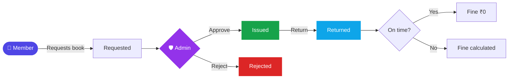
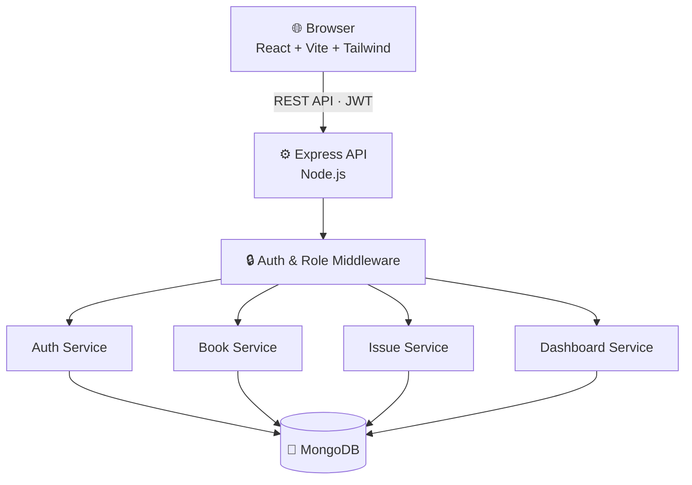

<div align="center">


<a href="https://github.com/rickchoudhary115/library_management">
  
</a>

<br/>

<a href="https://library-management-frontend-6kef.onrender.com/">
  
</a>

<br/><br/>


### Manage books, members, issue requests, returns and availability from one clean dashboard.

[**Live Demo**](https://library-management-frontend-6kef.onrender.com/) •
[**Features**](#-features) •
[**Screenshots**](#-screenshots) •
[**Workflow**](#-issue-workflow) •
[**Quick Start**](#-quick-start) •
[**API**](#-api-reference) •
[**Roadmap**](#-roadmap)

<br/>



</div>

<br/>

## ✨ Overview

**LibraryMS** is a full-stack web application that replaces paper registers and spreadsheets with a modern digital library. It gives **members** a smooth way to discover and request books, and gives **administrators** a powerful control center to run the whole operation.

<table>
<tr>
<td width="50%" valign="top">

### 😩 Before

- Manual book records
- Hard-to-track issued books
- No real-time availability
- Manual member management
- Fines calculated by hand
- No central admin view

</td>
<td width="50%" valign="top">

### 🚀 With LibraryMS

- Centralized digital catalog
- Request → approve → return workflow
- Live available / total copies
- Member list with issue activity
- Automatic fine calculation
- One admin dashboard for everything

</td>
</tr>
</table>

---

## 🌐 Live Demo

🔗 **[library-management-frontend-6kef.onrender.com](https://library-management-frontend-6kef.onrender.com/)**

> [!NOTE]
> The app is hosted on Render's free tier, so the first load may take 30-60 seconds while the server wakes up.

---

## 📸 Screenshots

<div align="center">

<table>
<tr>
<td align="center" width="50%">
<b>🔐 Login</b><br/><br/>

</td>
<td align="center" width="50%">
<b>📖 Book Details & Issue Request</b><br/><br/>

</td>
</tr>
</table>

<br/>

<b>👤 Member Dashboard</b><br/><br/>


<br/><br/>

<b>📚 Book Catalog with Live Availability</b><br/><br/>


<br/><br/>

<b>🛡️ Admin Control Center</b><br/><br/>


</div>

<details>
<summary><b>📊 See one more: dashboard overview</b></summary>
<br/>
<div align="center">

</div>
</details>

---

## 🚀 Features

<table>
<tr>
<td width="50%" valign="top">

### 👤 Members

🔐 **Authentication**
- Register & secure login (JWT)
- Protected routes
- Automatic session restoration

📚 **Book Discovery**
- Browse the full catalog
- Search by title, author or ISBN
- Detailed view with availability

📖 **Issue Requests**
- Request any available book
- Track request status
- See due dates and fines
- View returned books

📊 **Personal Dashboard**
- Active issues, pending requests, returns
- Quick actions

</td>
<td width="50%" valign="top">

### 🛡️ Administrators

📚 **Book Management**
- Add, edit and delete books
- Manage total & available copies

📋 **Issue Management**
- Review member requests
- Approve or reject with one click
- Manually issue books
- Process returns & monitor fines

👥 **Member Management**
- View registered members
- See member issue activity

📊 **Admin Hub**
- Central control center
- Quick administrative actions

</td>
</tr>
</table>

---

## 🔄 Issue Workflow



| Status | Meaning |
| :--- | :--- |
| 🟡 `requested` | Member has requested the book |
| 🟢 `issued` | Admin approved the request |
| 🔵 `returned` | Book has been returned |
| 🔴 `rejected` | Admin rejected the request |

> 💰 **Fines** are calculated automatically by the backend (`utils/calculateFine.js`) when a book is returned after its due date.

---

## 🧠 Architecture



---

## 🛠️ Tech Stack

<div align="center">

| Layer | Technologies |
| :---: | :--- |
| **Frontend** | React · Vite · Tailwind CSS · React Router · Axios · Lucide React |
| **Backend** | Node.js · Express.js · Mongoose · JWT · bcrypt |
| **Database** | MongoDB |

</div>

---

## 📁 Project Structure

<details>
<summary><b>Click to expand</b></summary>

```text
library_management/
├── backend/
│   ├── controllers/     auth · book · dashboard · issue
│   ├── middleware/      auth · role
│   ├── models/          Book · Issue · User
│   ├── routes/          auth · book · dashboard · issue
│   ├── services/        auth · book · dashboard · issue
│   ├── utils/           calculateFine.js
│   ├── .env.example
│   ├── package.json
│   └── server.js
│
├── frontend/
│   ├── public/
│   ├── src/
│   │   ├── components/  books · issues · common
│   │   ├── context/     AuthContext.jsx
│   │   ├── pages/       auth · admin · Dashboard · Books · Issues
│   │   ├── utils/       axios.js
│   │   ├── App.jsx
│   │   ├── main.jsx
│   │   └── index.css
│   ├── .env.example
│   └── package.json
│
├── screenshots/
├── .gitignore
└── README.md
```

</details>

---

## ⚡ Quick Start

**Prerequisites:** Node.js 18+, npm, and a MongoDB database (local or [MongoDB Atlas](https://www.mongodb.com/atlas)).

### 1️⃣ Clone

```bash
git clone https://github.com/rickchoudhary115/library_management.git
cd library_management
```

### 2️⃣ Backend

```bash
cd backend
npm install
```

Create `backend/.env`:

```env
PORT=5000
MONGO_URI=your_mongodb_connection_string
JWT_SECRET=your_jwt_secret
```

```bash
npm run dev
```

➡️ Runs on **http://localhost:5000**

### 3️⃣ Frontend

Open a new terminal:

```bash
cd frontend
npm install
```

Create `frontend/.env`:

```env
VITE_API_URL=http://localhost:5000/api
```

```bash
npm run dev
```

➡️ Open **http://localhost:5173**

> [!IMPORTANT]
> Never commit real `.env` files. Only `.env.example` files belong in the repository.

> [!TIP]
> New accounts are created as **members**. To get an admin, register a user and change its `role` to `admin` in the database.

---

## 🔌 API Reference

<details>
<summary><b>🔐 Authentication</b></summary>
<br/>

| Method | Endpoint | Access |
| :---: | :--- | :---: |
| `POST` | `/api/auth/register` | Public |
| `POST` | `/api/auth/login` | Public |
| `GET` | `/api/auth/me` | Authenticated |

</details>

<details>
<summary><b>📚 Books</b></summary>
<br/>

| Method | Endpoint | Access |
| :---: | :--- | :---: |
| `GET` | `/api/books` | Authenticated |
| `POST` | `/api/books` | Admin |
| `PUT` | `/api/books/:id` | Admin |
| `DELETE` | `/api/books/:id` | Admin |

</details>

<details>
<summary><b>📋 Issues</b></summary>
<br/>

| Method | Endpoint | Access |
| :---: | :--- | :---: |
| `GET` | `/api/issues` | Authenticated |
| `GET` | `/api/issues/members` | Admin |
| `POST` | `/api/issues/request` | Member |
| `POST` | `/api/issues` | Admin |
| `GET` | `/api/issues/requests` | Admin |
| `PUT` | `/api/issues/:id/approve` | Admin |
| `PUT` | `/api/issues/:id/reject` | Admin |
| `PUT` | `/api/issues/:id/return` | Admin |

</details>

<details>
<summary><b>📊 Dashboard</b></summary>
<br/>

| Method | Endpoint | Access |
| :---: | :--- | :---: |
| `GET` | `/api/dashboard` | Authenticated |

</details>

---

## 👑 Roles & Permissions

| Capability | 👤 Member | 🛡️ Admin |
| :--- | :---: | :---: |
| Browse & search books | ✅ | ✅ |
| Request a book | ✅ | ✅ |
| View own issues & returns | ✅ | ✅ |
| Add / edit / delete books | ❌ | ✅ |
| Approve / reject requests | ❌ | ✅ |
| Manually issue books | ❌ | ✅ |
| Process returns | ❌ | ✅ |
| View members | ❌ | ✅ |

---

## 🔒 Security

- 🔑 JWT authentication
- 🧂 Password hashing with bcrypt
- 🛑 Protected API routes
- 👮 Role-based authorization
- 🚧 Protected frontend routes
- 🙈 Secrets kept in environment variables
- 🪪 Member identity taken from the token on the server, not from the request body

---

## 🗺️ Roadmap

- [x] JWT authentication & role-based access
- [x] Book catalog with search
- [x] Request-based issue workflow
- [x] Automatic fine calculation
- [x] Member & admin dashboards
- [ ] Email notifications
- [ ] Book cover uploads
- [ ] Analytics & admin charts
- [ ] Member profile page
- [ ] Password reset & email verification
- [ ] Pagination & advanced filtering
- [ ] Book categories & reading history
- [ ] Fine payment integration
- [ ] Docker & cloud deployment
- [ ] Automated tests

---

## 🤝 Contributing

Contributions are welcome!

1. 🍴 Fork the repository
2. 🌿 Create a branch: `git checkout -b feature/your-feature`
3. 💾 Commit: `git commit -m "feat: add your feature"`
4. 🚀 Push: `git push origin feature/your-feature`
5. 🔁 Open a Pull Request

---

## 📄 License

This project is available for educational and development purposes.

---

<div align="center">

## 👨‍💻 Developer

**Anirban Choudhury**
Full-Stack Developer • AI/ML Developer

[](https://github.com/rickchoudhary115)

### ⭐ If you found this project useful, please give it a star!

**📚 Learn More. Read More. Build More.**


</div>
